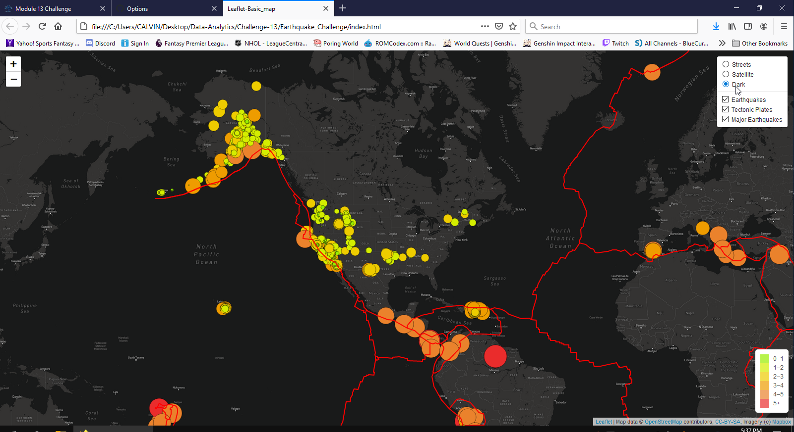

# Challenge-13
Purpose of this challenge is to create a webpage that displays earthquake and tectonic plate data displayed on a map with different overlay options available.

## Deliverable 1
For the first section, we add tectonic plate data by extracting from https://raw.githubusercontent.com/fraxen/tectonicplates/master/GeoJSON/PB2002_boundaries.json, where the geoJSON file provides linestring definitions of the plates. We apply this data onto the map by marking the plates with red lines and created an overlay button for users to hide/display those plates.

 

## Deliverable 2
For the second deliverable, we extracted earthquake data where magnitudes are 4.5+ from https://earthquake.usgs.gov/earthquakes/feed/v1.0/summary/4.5_week.geojson, where the geoJSON file provides the coordinates & magnitude for earthquakes of 4.5+ occurred. This data is applied onto the map using the same color scheme as our previous earthquake data and there is an overlay button to hide/display that data i.e. the 4.5+ magnitude earthquake data overlaps the previous earthquake data & uses same color scheme to re-use legend.

 

## Deliverable 3
For the third deliverable, we created another base overlap map where users now have three map options to choose from: street, satellite and dark mode.

 